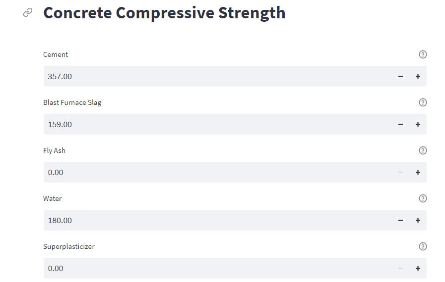
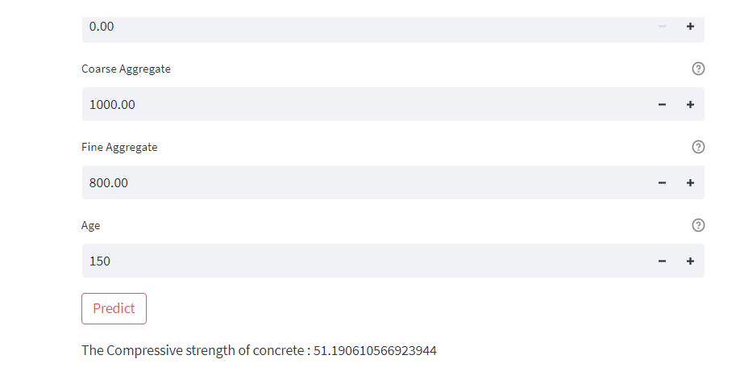

# Concrete Compressive Strength Prediction Web Application

The Concrete Compressive Strength Prediction Web Application is a powerful tool that uses machine learning to estimate the compressive strength of concrete based on various input parameters. This user-friendly application empowers users in the construction industry to make informed decisions and optimize their projects.

## Data Source

The data used for training the machine learning model in this project was collected from [Kaggle](https://www.kaggle.com). The specific dataset used can be found at the following link: [Link to Dataset](https://www.kaggle.com/datasets/niteshyadav3103/concrete-compressive-strength).

Please ensure that you comply with the terms and conditions of the data source when using the dataset for your own purposes.

## Features

- Predicts the compressive strength of concrete based on input parameters
- User-friendly interface for entering input values
- Pre-trained machine learning model for accurate predictions
- Provides valuable context and information for better interpretation of results
- Interactive features, including visual elements like balloons, for an engaging user experience

## Usage

1. Install the necessary dependencies: [list any dependencies or requirements]
2. Run the application: [provide instructions on how to run the application]
3. Open the web application in your browser.
4. Enter the input parameters for the concrete (cement, blast furnace slag, fly ash, water, superplasticizer, coarse aggregate, fine aggregate, and age).
5. Click the "Predict" button to get the estimated compressive strength.
6. View the predicted compressive strength and accompanying information.

## Example

## License

This project is licensed under the [insert license].

## Contributions

Contributions are welcome! If you find any issues or want to enhance the project, please feel free to submit a pull request.

